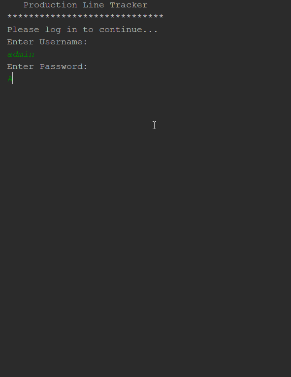

# ProceduralProject
Project created by Shane Broxson. Made in the summer of 2019. At beginning had no prior experience with C++ or C. Created for project assignment in summer course COP2001 (Programming Metholodogy). Worked on in class and out of class for about ~15-20 hours a week until firm grasp was held on what was being done with the language. At first was unsure about how the language worked but now would be able to branch into different utilites of C++ with ease. Working in some depth quickly in this language allowed for the opportunity of learning how to learn other languages without struggle.
## Demonstration

## Documentation
[docs](ShaneBroxson.github.io/ProceduralProject/docs/index.html)
## Diagrams
## Getting Started
When project folder is downloaded you should be able to run executable. Any additonal files for the project will be created on first run.
You will be prompted to enter the Username and Password when the program runs.  
The Default Username and Password: admin / Adm1n
## Built With
* CLion by JetBrains
* Visual Studio Compiler
* MinGW Compiler
## Contributing
GUI Development is most likely the next development process for this project.
## Author
* Shane Broxson
## License
No current license.
## Acknowledgments
* StackOverFlow
* cplusplus.com
* Prof. Scott Vanselow 
## History
Started with all vectors being passed in seperatly to deal and save all data being worked on. 
Added files to save data on.
Added code to populate vectors with existing data when program starts.
Changed vectors to be added to struct at beginning of file and associated function calls.
## Key Programming Concepts Utilized
* Procedural Programming
* Recursive Functions
* Vectors
* Data Structures
